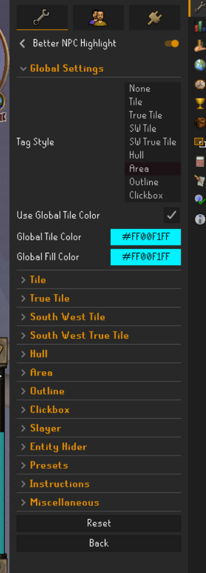
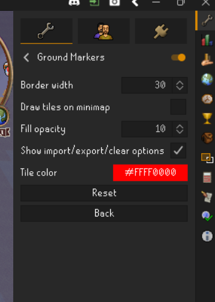

# 🦀 OSRS Ammonite Crab Automator

Este script automatiza el combate contra Ammonite Crabs en Old School RuneScape (OSRS). Utiliza visión por computadora básica (análisis de matrices de píxeles) para identificar objetivos, leer el XP tracker para verificar estados de combate y resetear el *aggro* dinámicamente. 

Su diseño incluye una rutina de calibración inicial de 3 clics, lo que lo hace completamente independiente de la resolución de tu pantalla o posición de la ventana.

## ⚙️ Requisitos y Dependencias

Asegúrate de tener Python instalado y ejecuta el siguiente comando para instalar las librerías necesarias para el control periférico y análisis de pantalla:

```bash
pip install pyautogui numpy pynput

```

## 🎨 Configuración de RuneLite (Obligatorio)

Para que el script reconozca a los cangrejos y las zonas de movimiento, necesitas configurar los siguientes plugins en RuneLite utilizando colores exactos.

*(Asegúrate de configurar la opacidad de los colores al máximo para evitar ruido en la lectura de píxeles).*

### 1. Plugin: Better NPC Highlight (Cangrejos)

Este plugin resaltará los Ammonite Crabs para que el bot pueda hacerles clic.

* **NPCs a resaltar:** `Ammonite Crab`
* **Color:** Celeste (RGB: `0, 241, 255`).
* **Referencia Visual:** 

### 2. Plugin: Ground Markers (Reset de Aggro)

Marca un *tile* lo suficientemente alejado de tu zona de farmeo para que el bot corra hacia allá cuando no haya cangrejos, reseteando así la agresividad de los NPCs.

* **Color:** Rojo (RGB: `245, 0, 0`).
* **Referencia Visual:** 

## 🚀 Flujo de Ejecución y Calibración

1. **Ejecuta el script:** Inicia el bot desde tu terminal (`python bot_crabs.py`).
2. **Prepara tu ventana:** Ve al juego, acomoda la cámara (idealmente vista superior y zoom alejado) y asegúrate de tener el XP Tracker visible.
3. **Habilita los clics:** Presiona la tecla **`S`** en tu teclado.
4. **Calibración de 3 Clics:** Haz clic izquierdo con tu mouse en el siguiente orden estricto:
* **Clic 1:** En el **centro exacto** de tu personaje (define el radio de búsqueda y movimiento).
* **Clic 2:** En la **esquina inferior izquierda** del recuadro del XP Tracker.
* **Clic 3:** En la **esquina superior derecha** del recuadro del XP Tracker.


5. ¡El bot calculará las áreas y comenzará a cazar automáticamente en 3 segundos!

## 🎮 Controles de Teclado

* `S` : **Start Setup.** Habilita el *listener* del mouse para iniciar la configuración de la pantalla.
* `P` : **Pausa / Reanudar.** Interrumpe la ejecución temporalmente. Útil para tomar el control, chatear o mover la cámara sin tener que recalibrar los clics.
* `ESC` : **Kill Switch.** Termina el proceso de Python de forma inmediata y segura.

## ⚠️ Advertencia de Seguridad (Anti-Ban Measures)

Este script incluye offsets de clics aleatorios, variaciones en los tiempos de espera (`time.sleep`) y movimientos de mouse con curvas de aceleración (Bézier/EaseOutQuad) para imitar el comportamiento humano. Sin embargo, el uso de macros y automatización va en contra de los *Terms of Service* (ToS) de Jagex. Úsalo bajo tu propia responsabilidad.

